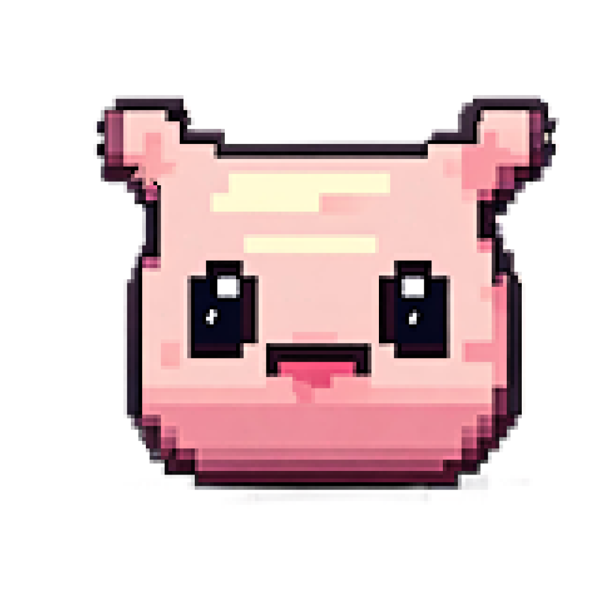

<p align="center">
  <a href="" rel="noopener">
 </a>
</p>

<h3 align="center">DigiPet</h3>

<div align="center">

  []() 
  [](https://github.com/marvinboral/digiPet)
  [](https://github.com/marvinboral/digiPet/pulls)
  [](/LICENSE)

</div>

---

<p align="center"> digiPet
    <br> 
</p>

## 📝 Table of Contents
- [Project Introduction](#project_intro)
- [Project Goal](#project_goal)
- [Getting Started](#getting_started)
  - [Installation Steps](#installation-steps)
  - [Installation of Visual Studio Community](#installation-of-visual-studio-community)
  - [Installation of Node.js](#node)
  - [Installation of Expo Go](#expo_go)
  - [Cloning Repo in Visual Studio Steps](#clone)
  - [Running the Project in Visual Studio](#running-the-project-in-visual-studio)
  - [Additional Notes](#additional-notes)
- [File Structure](#file_structure)
- [Built Using](#built_using)
- [Contributing](../CONTRIBUTING.md)
- [Authors](#authors)
- [Acknowledgments](#acknowledgement)

# 🧐 Project Introduction <a name = "project_intro"></a>
This assignment is `digiPet` which aims to demonstrate our competency with various controls based on what we have learned in Mobile Application Development. 

## Project Goal <a name = "project_goal"></a>
The goal of this project is to create a digital pet that contains the following features.

The pet should:

- maintain its state between app launches
  - start in some happy state
  - over time transition to some less happy state
  - regain happiness when "treated"
- respond to gestures for example
  - petting/swiping
  - patting/tapping
  - walking/dragging
- keep track of toys/inventory/points/whatever
- produce feedback for the user when events occur
  - vibration
  - sound
  - colours
  - animation

**In Scope** for this project, means that these are the items that I was able to implement.
- petState
- petState transitions to some less happy state or `worse` if there is no interaction done within a specified amount of time. clingy much
- regain normal state when interacting like patting or feeding
- sounds via expo-av

**Out of Scope** - items that I didn't have the chance to implement or include in this project because of `reasons`, but mainly due to insufficient time for a lot of stuff. Maybe for the final project. hmmm
- inventory
- haptics
- orientation
- expo-sqlite or database

# 🏁 Getting Started <a name = "getting_started"></a>
These instructions will get you a copy of the project up and running on your local machine for development and testing purposes. 

## Prerequisites
What things do you need to install the software and how to install them

- Visual Studio 2022
- Node.js
- Expo Go
- Android Studio 
   
## Installation Steps

### Installation of Visual Studio Community <a name = "installation-of-visual-studio-community"></a>
- Visit  [this link](https://visualstudio.microsoft.com/vs/community/) to download and install Visual Studio Community from the official Visual Studio website.

### Installation of Node.js <a name = "node"></a>
- Visit [thislink](https://docs.npmjs.com/downloading-and-installing-node-js-and-npm) for the guide and installation of Node.js

### Installation of Expo Go <a name = "expo_go"></a>
- Visit the following links for the detailed steps of installing Expo Go in your system
  - [Installation Guide](https://docs.expo.dev/get-started/installation/) - Installation
  - [How to install in your Device](https://docs.expo.dev/get-started/expo-go/) - Guide to installing to your mobile device
  - [Create and run a project](https://docs.expo.dev/get-started/create-a-project/) - creating and running a project

### Cloning Repo in Visual Studio Steps <a name = "clone"></a>
- Follow these steps to clone a repository in Visual Studio:
  1. Open Visual Studio.
  2. Go to the "Team Explorer" tab.
  3. Click on the "Manage Connections" icon (usually looks like a plug).
  4. Click on "Clone" under the "Local Git Repositories" section.
  5. Enter the URL of the repository you want to clone.
     ```
     https://github.com/marvinboral/digiPet.git
     ```
  7. Choose a local path for the repository.
  8. Click "Clone" to start the cloning process.

## Running the Project in Visual Studio <a name = "running-the-project-in-visual-studio"></a>

Once you have cloned the repository and configured the SQL Server, follow these steps to run the project in Visual Studio:

1. Open Visual Studio.
2. Open the project solution file (.sln) from the cloned repository usually named as PEMS.sln.
3. In the View tab, click terminal it will show the developer powershell on the bottom of your screen.
4. Navigate to the file location of the project folder using: `cd`.
5. Navigate to the digiPet: `cd digiPet` and install the following dependencies.
   Alternatively, you may copy and paste this to `dependencies` section of the `package.json` file
   ```
    "@expo/vector-icons": "^14.0.0",
    "expo": "^50.0.14",
    "expo-av": "~13.10.5",
    "expo-file-system": "^16.0.8",
    "expo-haptics": "^12.8.1",
    "expo-splash-screen": "~0.26.4",
    "expo-sqlite": "^13.4.0",
    "expo-status-bar": "~1.11.1",
    "react": "18.2.0",
    "react-native": "^0.73.6",
    "react-native-gesture-handler": "^2.15.0",
    "react-native-haptics": "^0.0.0",
    "react-native-orientation": "^3.1.3"
7. Run npm install in the same directory location to install the dependencies: `npm install`
8. Run `npx expo start --tunnel` to start the project and scan the generated QR code using the camera of your mobile device or press "a" to run on Android device using your Android emulator
      

## Additional Notes
- If you encounter any issues during installation or configuration, refer to the official documentation provided by Microsoft, Visual Studio Community, or Expo Go.

#  File Structure <a name = "file_structure"></a>

This project is organized into several directories and files. 

# 📁  digiPet

Main directory

## 📁  assets
Contains the assets used for this project.  As of this documentation, it has two subfolders `📁 images` and `📁 sounds`

## 📁 Components
- `Interaction.js`: Handles the interaction components and buttons for the pet. 
- `Inventory.js`: Supposed to handle the inventory system for the pet. `not implemented`
- `Pet.js`: Handles the petState and image mapping of the pet according to its State.

## 📁 Styles
Handles the styles per component. 
- `interactionStyle.js`
- `inventoryStyle.js`
- `petStyles.js`

## 📁 screens
- `SplashScreen.js` - handles the SplashScreen animation 

## Main Files

This directory contains the main files of digiPet.

- `App.js`: This is the main JavaScript file that holds the base component of the React app.

## 🎈 Usage <a name="usage"></a>
Add notes about how to use the system. (TO DO)

## 🚀 Deployment <a name = "deployment"></a>
TO DO

## ⛏️ Built Using <a name = "built_using"></a>
- [MS SQL 2019](https://www.microsoft.com/en-us/sql-server/sql-server-2019) - Database
- [Windows Server 2019](https://www.microsoft.com/en-us/evalcenter/evaluate-windows-server-2019#Overview) - Server Framework and Environment
- [.NET 6](https://learn.microsoft.com/en-us/dotnet/core/whats-new/dotnet-6) - Web Framework
- [Javascript](https://www.javascript.com/) - Front-End Web Development
- [Microsoft C#](https://learn.microsoft.com/en-us/dotnet/csharp/) - Back-End Development

## ✍️ Authors <a name = "authors"></a>
- [@marvinboral](https://github.com/marvinboral) 

## 🎉 Acknowledgements <a name = "acknowledgement"></a>
- [How to create an App Icon and Splash Screen for an Expo Project](https://www.youtube.com/watch?v=QSNkU7v0MPc) 
- [Splash Screen code](https://docs.expo.dev/versions/latest/sdk/splash-screen/)
- [RO Data](https://rod.2-d.jp/index.php/page/mob2) - source of my pet images which is poring from Ragnarok Online
  
